# Hify 前端页面操作手册与 Agent 构建原理说明

本文面向 Hify 产品使用者和交付/演示人员，说明如何通过前端页面从零构建一个自定义 Agent，并最终在对话页面完成问答。文档同时结合后端模块、服务能力和数据库表结构，解释各页面之间的关系。

说明：本文按“产品完成态”编写。当前前端代码中部分入口尚未完全实现，例如 Agent 绑定知识库/工作流、Agent 工具绑定列表加载、模型配置管理等；这些能力在后端服务、数据库表或对话运行链路中已经有对应支撑，本文将其作为前端已具备能力进行说明，并在末尾列出当前前端需补齐项。

---

## 1. 产品目标

Hify 是一个轻量级 AI Agent 搭建平台。用户不需要写代码，只需要在前端完成以下配置，就可以得到一个能对话、能检索知识库、能调用外部工具、也能按流程编排执行的自定义 Agent。

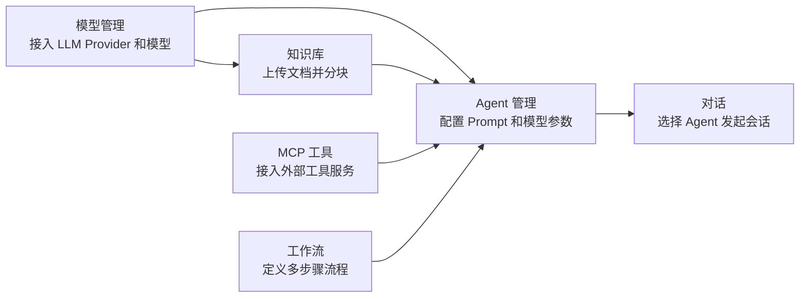

完整用户路径可以概括为：

1. 在“模型管理”接入模型提供商，并准备可选模型。
2. 可选：在“知识库”创建知识库并上传文档。
3. 可选：在“MCP 工具”接入外部工具服务，并完成工具调试。
4. 可选：在“工作流”创建流程编排。
5. 在“Agent”创建 Agent，绑定模型、Prompt、知识库、工具和工作流。
6. 在“对话”新建会话，选择 Agent 并发送消息。

---

## 2. 前端页面地图

Hify 前端采用左侧导航 + 右侧工作区布局。主导航来自 `hify-web/src/App.vue`，路由来自 `hify-web/src/router/index.ts`。

| 导航 | 路由 | 页面组件 | 页面职责 |
| --- | --- | --- | --- |
| 模型管理 | `/provider` | `ProviderList.vue` | 管理 LLM 提供商、鉴权、Base URL、健康检测、模型配置 |
| Agent | `/agent` | `AgentList.vue` | 创建 Agent，配置模型、Prompt、生成参数、绑定知识库/工作流/MCP 工具 |
| 知识库 | `/knowledge` | `KnowledgeList.vue` | 创建知识库、搜索、启停、删除 |
| 知识库文档 | `/knowledge/:kbId/documents` | `DocumentList.vue` | 上传文档、查看处理状态、预览分块 |
| 工作流 | `/workflows` | `WorkflowList.vue` | 查看工作流、查看节点/连线详情、删除 |
| 新建工作流 | `/workflows/create` | `WorkflowCreate.vue` | 通过节点和连线配置创建工作流 |
| MCP 工具 | `/mcp` | `McpServerList.vue` | 管理 MCP Server、连通测试、进入调试 |
| MCP 调试 | `/mcp/:id/debug` | `McpServerDebug.vue` | 查看工具列表、填写参数、执行工具调用 |
| 对话 | `/chat` | `ChatView.vue` | 新建会话、选择 Agent、发送消息、展示流式回复 |

页面之间不是孤立关系，而是围绕 Agent 形成配置链路。

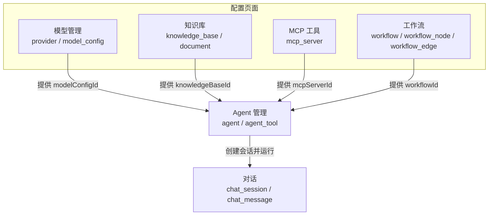

---

## 3. 数据模型和后端模块关系

### 3.1 核心数据关系

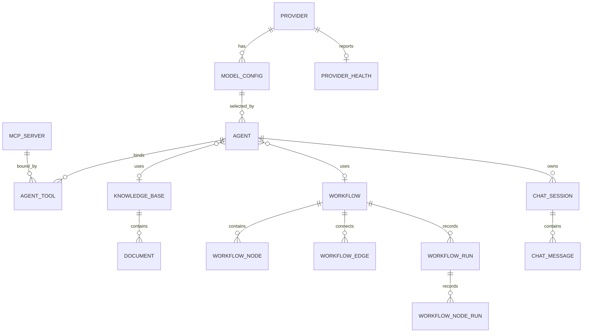

### 3.2 主要表说明

| 表 | 对应模块 | 作用 | 关键字段 |
| --- | --- | --- | --- |
| `provider` | `hify-provider` | 模型提供商配置 | `name`, `type`, `base_url`, `auth_config`, `enabled` |
| `model_config` | `hify-provider` | 具体模型或 deployment | `provider_id`, `name`, `model_id`, `context_size`, `enabled` |
| `provider_health` | `hify-provider` | 提供商健康状态 | `status`, `latency_ms`, `fail_count`, `error_message` |
| `agent` | `hify-agent` | Agent 主配置 | `system_prompt`, `model_config_id`, `temperature`, `knowledge_base_id`, `workflow_id` |
| `agent_tool` | `hify-agent` | Agent 与 MCP Server 的多对多绑定 | `agent_id`, `mcp_server_id` |
| `mcp_server` | `hify-mcp` | 外部工具服务 | `name`, `endpoint`, `enabled` |
| `knowledge_base` | `hify-knowledge` | 知识库 | `name`, `description`, `enabled` |
| `document` | `hify-knowledge` | 知识库文档 | `knowledge_base_id`, `status`, `chunk_count` |
| `workflow` | `hify-workflow` | 工作流主表 | `name`, `description`, `status` |
| `workflow_node` | `hify-workflow` | 工作流节点 | `node_key`, `type`, `config` |
| `workflow_edge` | `hify-workflow` | 工作流连线 | `source_node_key`, `target_node_key`, `condition_expr` |
| `workflow_run` | `hify-workflow` | 工作流执行记录 | `input`, `output`, `status`, `elapsed_ms` |
| `workflow_node_run` | `hify-workflow` | 节点执行记录 | `node_key`, `outputs`, `status` |
| `chat_session` | `hify-chat` | 会话 | `agent_id`, `title`, `status` |
| `chat_message` | `hify-chat` | 对话消息 | `session_id`, `role`, `content`, `tokens`, `latency_ms` |

数据库注意事项：当前 `schema-h2.sql` 包含知识库、工作流、Agent 绑定字段等完整 mock 表结构；`schema.sql` 的 MySQL 版本只包含 Provider、Model、MCP、Agent、Chat 等早期表，缺少 `knowledge_base`、`document`、`workflow*` 以及 `agent.knowledge_base_id`、`agent.workflow_id`。产品手册按后端实体和 H2 完整结构说明，生产 MySQL 需要补齐 DDL 后才能完整运行这些能力。

### 3.3 模块与页面映射

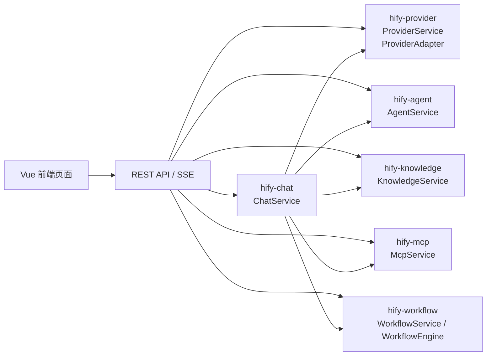

| 页面 | 后端接口 | 后端服务 |
| --- | --- | --- |
| 模型管理 | `/api/v1/providers`、`/api/v1/providers/{id}/test-connection` | `ProviderService`, `ProviderConnectionTestService` |
| Agent | `/api/v1/agents`、`/api/v1/agents/{id}/tools` | `AgentService` |
| 知识库 | `/api/v1/knowledge-bases` | `KnowledgeService` |
| 文档管理 | `/api/v1/knowledge-bases/{kbId}/documents`、`/api/v1/documents/{id}/chunks` | `KnowledgeService` |
| MCP 工具 | `/api/v1/mcp-servers`、`/test`、`/tools`、`/debug` | `McpService` |
| 工作流 | `/api/v1/workflows` | `WorkflowService`, `WorkflowEngine` |
| 对话 | `/api/v1/chat/sessions`、`/messages`、`/messages/stream` | `ChatService` |

---

## 4. 从零构建 Agent 的推荐流程

下面以“电商售后客服 Agent”为例，演示如何完成一个可对话 Agent。

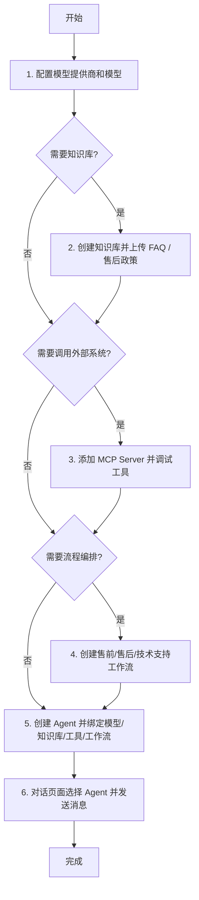

### 最短路径

如果只想快速创建一个能聊天的 Agent：

1. 模型管理：新增 Provider，并准备至少一个启用模型。
2. Agent：新增 Agent，选择模型，填写 System Prompt。
3. 对话：新建会话，选择 Agent，发送消息。

### 增强路径

如果要让 Agent 更接近业务可用：

1. 知识库：上传 FAQ、产品说明、退款规则等文档。
2. MCP 工具：接入订单、退款、物流等外部系统工具。
3. 工作流：将用户意图先分类，再进入不同处理节点。
4. Agent：绑定上述知识库、工具和工作流。

---

## 5. 页面操作手册

### 5.1 模型管理

页面路径：`/provider`

页面目标：接入可用的大模型服务商，并为 Agent 提供可选模型。

#### 页面结构示意

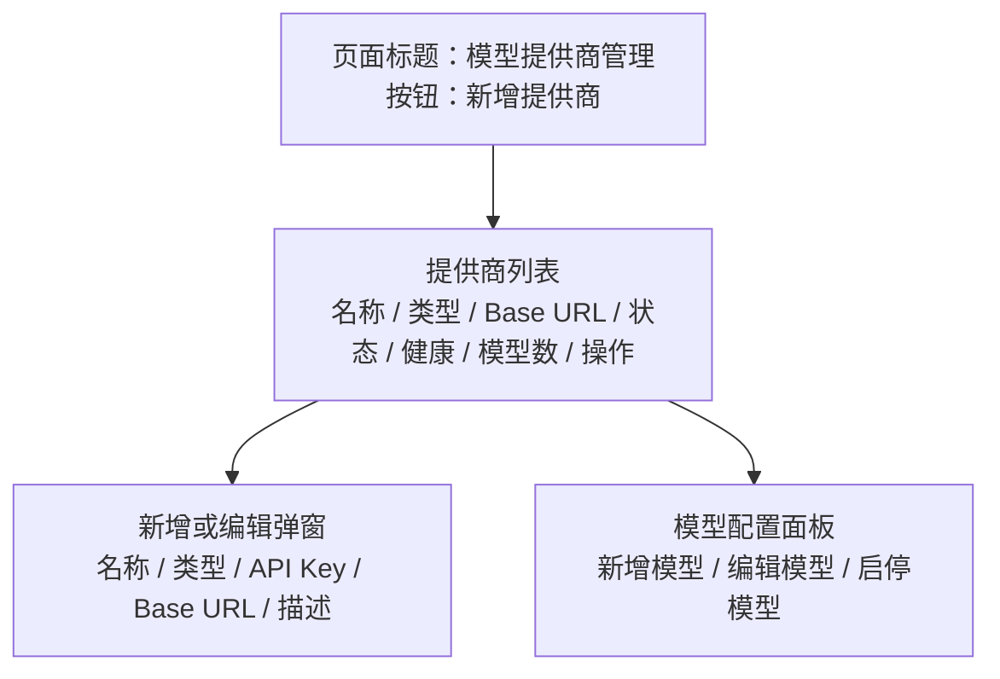

#### 新增模型提供商

1. 进入“模型管理”。
2. 点击“新增提供商”。
3. 填写：
   - 名称：例如 `OpenAI`、`本地 Ollama`、`DeepSeek Compatible`。
   - 类型：选择 `OPENAI`、`ANTHROPIC`、`AZURE_OPENAI`、`OLLAMA` 或 `OPENAI_COMPATIBLE`。
   - API Key：填写服务商密钥；本地 Ollama 可按部署情况留空。
   - Base URL：例如 `https://api.openai.com` 或 `http://localhost:11434`。
   - 描述：可选。
4. 点击“确认”。

后端对应：

- 创建 Provider：`POST /api/v1/providers`
- 数据落表：`provider`
- 鉴权配置存入：`provider.auth_config`

#### 配置模型

产品完成态下，提供商详情中应提供“模型配置”面板。用户需要添加至少一个启用模型，否则 Agent 无法选择模型。

推荐字段：

| 字段 | 示例 | 说明 |
| --- | --- | --- |
| 模型名称 | `GPT-4o` | 前端展示名称 |
| 模型 ID | `gpt-4o` | 调用 API 时传给模型厂商的真实标识 |
| 上下文窗口 | `128000` | 可选，用于提示和限制 |
| 扩展参数 | `{"maxTokens":4096}` | 可选，模型级参数 |
| 状态 | 启用 | 只有启用模型可被 Agent 选择 |

后端对应：

- 数据表：`model_config`
- Agent 创建/更新时通过 `ProviderService.getEnabledModelConfigOrThrow(modelConfigId)` 校验模型是否存在且启用。

#### 测试连接

1. 在提供商列表找到目标 Provider。
2. 点击“测试”。
3. 查看结果：
   - 成功：显示延迟和模型数量。
   - 失败：显示错误原因。

后端对应：

- 测试接口：`POST /api/v1/providers/{id}/test-connection`
- 服务：`ProviderConnectionTestService`
- 适配层：`ProviderAdapter.testConnection`

#### 健康状态

系统会通过 `ProviderHealthCheckTask` 周期性检测启用的 Provider。前端展示：

- `正常`：`UP`
- `降级`：`DEGRADED`
- `故障`：`DOWN`
- `未知`：`UNKNOWN`

---

### 5.2 知识库管理

页面路径：`/knowledge`

页面目标：管理 RAG 知识库。知识库绑定到 Agent 后，Agent 在回答前会检索相关文档片段，并把片段拼接到 System Prompt 中。

#### 页面关系

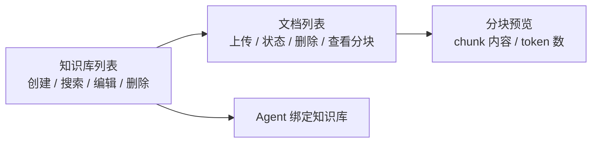

#### 创建知识库

1. 进入“知识库”。
2. 点击“新建知识库”。
3. 填写名称和描述。
4. 点击“确定”。

后端对应：

- 创建接口：`POST /api/v1/knowledge-bases`
- 数据落表：`knowledge_base`

#### 上传文档

1. 在知识库卡片中点击“查看文档”。
2. 点击“上传文档”。
3. 选择或拖拽文件。
4. 点击“开始上传”。

支持格式：

| 格式 | 支持情况 |
| --- | --- |
| `.txt` | 支持，直接读取文本 |
| `.md` | 支持，直接读取文本 |
| `.pdf` | 支持上传；mock 模式下不解析正文，仅生成占位分块 |

限制：

- 单文件最大 10MB。
- 上传后状态会从 `PENDING` 到 `PROCESSING`，最终变为 `DONE` 或 `FAILED`。

后端对应：

- 上传接口：`POST /api/v1/knowledge-bases/{kbId}/documents`
- 文档表：`document`
- 状态字段：`document.status`
- 当前 mock 分块存储在内存 `MOCK_CHUNKS`；真实生产版本应接入 Embedding + pgvector。

#### 查看文档分块

1. 文档状态为“已完成”后，点击“查看分块”。
2. 查看每个 chunk 的内容、序号和 token 数。

后端对应：

- 分块接口：`GET /api/v1/documents/{id}/chunks`
- DTO：`ChunkVO`

#### 在 Agent 中使用知识库

1. 进入“Agent”。
2. 新建或编辑 Agent。
3. 在“知识库绑定”中选择目标知识库。
4. 保存 Agent。

对话时，后端会执行：

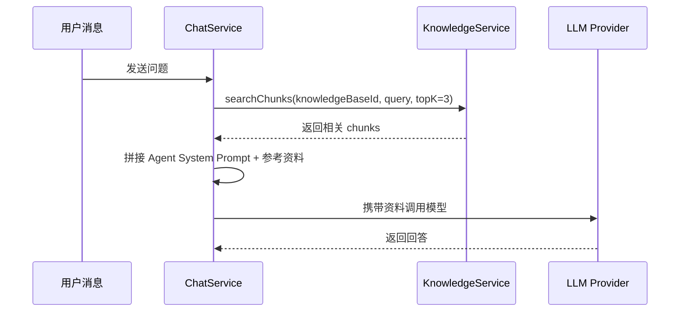

---

### 5.3 MCP 工具服务

页面路径：

- MCP 列表：`/mcp`
- MCP 调试：`/mcp/:id/debug`

页面目标：让 Agent 能通过 MCP Server 调用外部业务工具，例如查订单、查物流、提交退款等。

#### MCP 列表页面

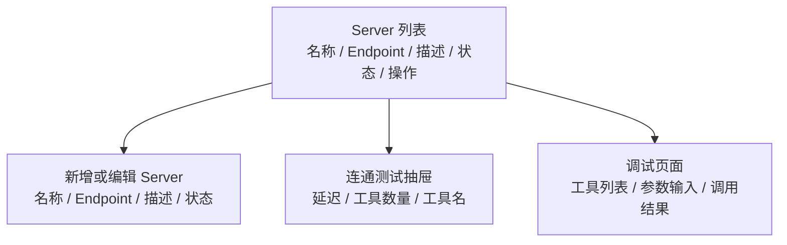

#### 新增 MCP Server

1. 进入“MCP 工具”。
2. 点击“新增 Server”。
3. 填写：
   - 名称：例如 `订单服务`、`退款服务`、`物流服务`。
   - Endpoint：例如 `http://localhost:9001/mcp`。
   - 描述：可选。
4. 点击“确认”。

后端对应：

- 创建接口：`POST /api/v1/mcp-servers`
- 数据落表：`mcp_server`

#### 测试 MCP Server

1. 在 Server 列表点击“测试”。
2. 查看连通结果：
   - 成功：显示延迟和发现的工具列表。
   - 失败：显示错误信息。

后端对应：

- 测试接口：`POST /api/v1/mcp-servers/{id}/test`
- 服务：`McpService.testConnection`
- 协议客户端：`McpClient` + SSE transport

#### 调试工具

1. 在 Server 列表点击“调试”。
2. 左侧选择工具。
3. 填写参数：
   - 表单模式：按工具 schema 自动生成字段。
   - JSON 模式：直接输入参数 JSON。
4. 点击“执行调用”。
5. 右侧查看返回结果、耗时、错误信息和调用历史。

后端对应：

- 工具列表：`GET /api/v1/mcp-servers/{id}/tools`
- 工具调试：`POST /api/v1/mcp-servers/{id}/debug`
- 真正调用：`McpService.callTool`

#### 在 Agent 中绑定工具

1. 进入“Agent”。
2. 新建或编辑 Agent。
3. 打开“工具绑定”页签。
4. 勾选一个或多个启用的 MCP Server。
5. 保存。

后端对应：

- 绑定接口：`PUT /api/v1/agents/{id}/tools`
- 数据落表：`agent_tool`

对话时，如果用户问题触发了模型的 tool call，后端会：

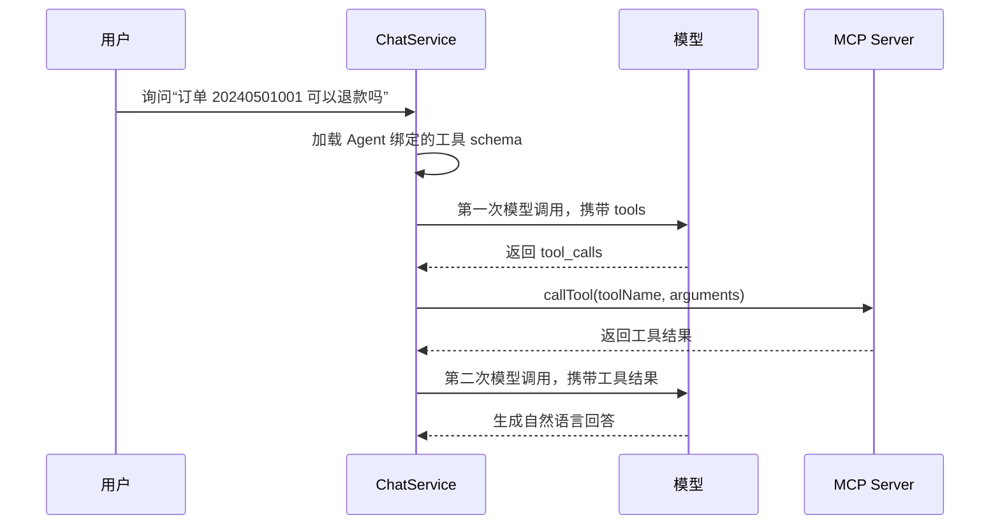

---

### 5.4 工作流管理

页面路径：

- 工作流列表：`/workflows`
- 新建工作流：`/workflows/create`

页面目标：将多步骤推理、知识检索、条件判断和 API 调用编排成一个流程。Agent 绑定工作流后，对话优先进入工作流执行，而不是直接走普通 LLM 对话链路。

#### 工作流结构

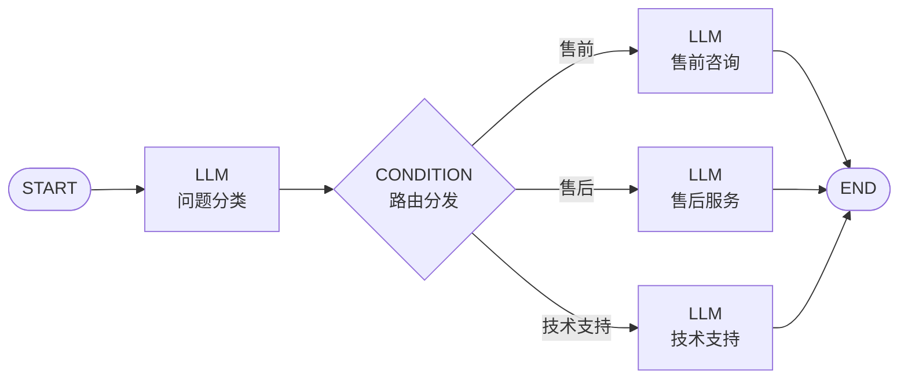

#### 节点类型

| 节点类型 | 作用 | 关键配置 |
| --- | --- | --- |
| `START` | 流程入口，写入用户消息变量 | 无 |
| `LLM` | 调用模型生成结果 | `modelConfigId`, `prompt`, `outputVariable` |
| `KNOWLEDGE` | 检索知识库 | `knowledgeBaseId`, `query`, `topK`, `outputVariable` |
| `CONDITION` | 根据变量结果选择分支 | `expression`, `outputVariable` |
| `API_CALL` | 发起 HTTP 请求 | `url`, `method`, `outputVariable` |
| `END` | 流程结束并指定输出变量 | `outputVariable` |

#### 变量引用规则

工作流执行时维护一个变量池。变量格式为：

```text
{{nodeKey.variableName}}
```

常用变量：

| 变量 | 含义 |
| --- | --- |
| `{{start.userMessage}}` | 用户本次输入 |
| `{{classify.intent}}` | `classify` 节点输出的 `intent` |
| `{{kb.docs}}` | `kb` 节点输出的知识库片段 |

#### 新建工作流

1. 进入“工作流”。
2. 点击“新建工作流”。
3. 填写名称和描述。
4. 在工作流配置区填写 JSON，包含 `nodes` 和 `edges`。
5. 点击“格式化”检查 JSON。
6. 点击“创建工作流”。

示例 JSON：

```json
{
  "nodes": [
    { "nodeKey": "start", "type": "START", "name": "开始", "config": {} },
    {
      "nodeKey": "classify",
      "type": "LLM",
      "name": "问题分类",
      "config": {
        "prompt": "你是意图分类器，用户消息：{{start.userMessage}}，仅回复：售前、售后 或 技术支持",
        "outputVariable": "intent"
      }
    },
    {
      "nodeKey": "router",
      "type": "CONDITION",
      "name": "路由分发",
      "config": {
        "expression": "{{classify.intent}}",
        "outputVariable": "route"
      }
    },
    {
      "nodeKey": "aftersale",
      "type": "LLM",
      "name": "售后服务",
      "config": {
        "prompt": "你是售后客服，解答退换货和保修问题。用户问题：{{start.userMessage}}",
        "outputVariable": "answer"
      }
    },
    { "nodeKey": "end", "type": "END", "name": "结束", "config": { "outputVariable": "answer" } }
  ],
  "edges": [
    { "sourceNodeKey": "start", "targetNodeKey": "classify", "condition": null },
    { "sourceNodeKey": "classify", "targetNodeKey": "router", "condition": null },
    { "sourceNodeKey": "router", "targetNodeKey": "aftersale", "condition": "售后" },
    { "sourceNodeKey": "aftersale", "targetNodeKey": "end", "condition": null }
  ]
}
```

后端对应：

- 创建接口：`POST /api/v1/workflows`
- 主表：`workflow`
- 节点表：`workflow_node`
- 连线表：`workflow_edge`

#### 查看工作流详情

1. 在工作流列表点击“查看”。
2. 抽屉中查看：
   - 基本信息。
   - 所有节点。
   - 节点配置 JSON。
   - 所有连线和分支条件。

#### 在 Agent 中使用工作流

1. 进入“Agent”。
2. 新建或编辑 Agent。
3. 在“工作流绑定”中选择目标工作流。
4. 保存 Agent。

工作流优先级说明：

- 如果 Agent 绑定了 `workflowId`，对话会优先进入 `WorkflowEngine.execute(workflowId, userMessage)`。
- 工作流路径会直接返回工作流输出。
- 普通 RAG、MCP 工具调用链路不会同时执行，除非工作流内部使用 `KNOWLEDGE`、`API_CALL` 或 `LLM` 节点实现类似能力。

---

### 5.5 Agent 管理

页面路径：`/agent`

页面目标：把模型、Prompt、生成参数、知识库、MCP 工具和工作流组合成一个可运行 Agent。

#### Agent 配置关系

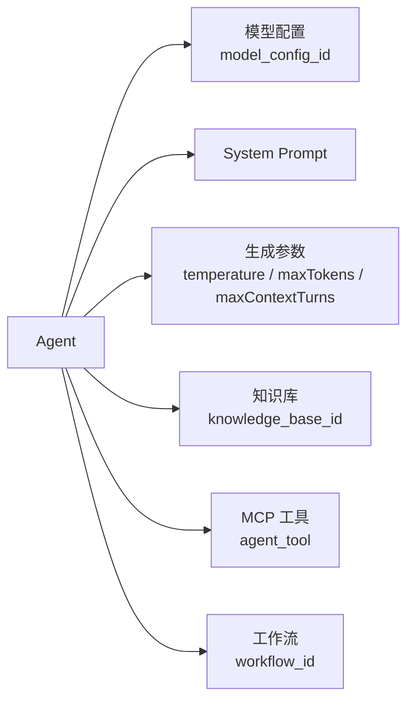

#### 新建 Agent

1. 进入“Agent”。
2. 点击“新增 Agent”。
3. 在“基本配置”填写：
   - 名称：例如 `售后客服 Agent`。
   - 描述：说明用途。
   - 模型：选择一个启用的模型配置。
   - System Prompt：定义角色、边界和回答风格。
   - Temperature：控制随机性，建议客服类场景使用 `0.2` 到 `0.5`。
   - 最大输出 Token：控制单次回答长度。
   - 上下文轮数：控制保留最近 N 轮历史。
4. 可选：在“知识库绑定”选择知识库。
5. 可选：在“工具绑定”勾选 MCP Server。
6. 可选：在“工作流绑定”选择工作流。
7. 点击“确认”。

推荐客服 Prompt：

```text
你是 Hify 电商平台的售后客服。
请用中文回答，语气专业、简洁、友好。
当用户询问退款、订单、物流状态时，优先使用可用工具查询真实结果。
当用户询问政策、规则、产品说明时，优先依据知识库资料回答。
如果资料或工具没有结果，请明确说明无法确认，不要编造。
```

后端对应：

- 创建 Agent：`POST /api/v1/agents`
- 更新 Agent：`PUT /api/v1/agents/{id}`
- 绑定工具：`PUT /api/v1/agents/{id}/tools`
- 数据表：`agent`, `agent_tool`

#### 编辑 Agent

1. 在 Agent 列表点击“编辑”。
2. 修改基本配置或绑定项。
3. 点击“保存”。

编辑时常见场景：

| 场景 | 操作 |
| --- | --- |
| 回答太发散 | 降低 Temperature |
| 回答太短 | 增大最大输出 Token |
| 需要引用业务文档 | 绑定知识库 |
| 需要查订单/退款 | 绑定 MCP 工具 |
| 需要先分流再回答 | 绑定工作流 |

#### Agent 列表信息

列表中建议展示：

- 名称和描述。
- 关联模型。
- 绑定工具数。
- 是否绑定知识库。
- 是否绑定工作流。
- Temperature。
- 启用状态。
- 创建时间。

---

### 5.6 对话

页面路径：`/chat`

页面目标：选择一个 Agent，创建会话，并与 Agent 进行多轮对话。

#### 页面结构

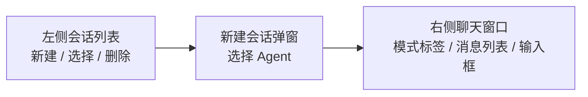

#### 新建会话

1. 进入“对话”。
2. 点击左侧“新建”。
3. 在弹窗中选择 Agent。
4. 点击“确定”。

Agent 选项会显示能力标签：

- “工作流”：该 Agent 绑定了工作流。
- “知识库”：该 Agent 绑定了知识库。
- “工具”：该 Agent 绑定了 MCP 工具。

后端对应：

- 创建会话：`POST /api/v1/chat/sessions`
- 数据落表：`chat_session`

#### 发送消息

1. 在底部输入框输入问题。
2. 按 Enter 或点击“发送”。
3. 右侧消息区显示用户消息和 AI 回复。
4. 回复过程中按钮显示“生成中”，内容按流式逐步出现。

后端对应：

- 同步消息：`POST /api/v1/chat/sessions/{sessionId}/messages`
- 流式消息：`POST /api/v1/chat/sessions/{sessionId}/messages/stream`
- 消息落表：`chat_message`

#### 查看历史会话

1. 左侧会话列表按创建时间倒序展示。
2. 点击任意会话可加载历史消息。
3. 鼠标悬停会话后可删除。

后端对应：

- 会话列表：`GET /api/v1/chat/sessions`
- 消息列表：`GET /api/v1/chat/sessions/{sessionId}/messages`
- 删除会话：`DELETE /api/v1/chat/sessions/{sessionId}`

---

## 6. 对话运行原理

`hify-chat` 是运行时中枢。一次消息发送后，后端会根据 Agent 的配置自动选择路径。

### 6.1 总体运行流程

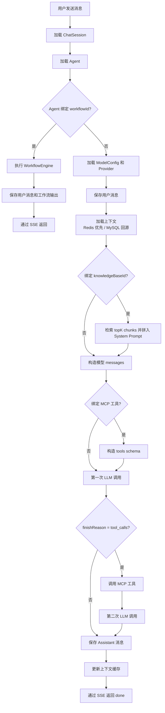

### 6.2 上下文机制

Agent 的 `maxContextTurns` 控制保留最近 N 轮上下文。后端实际取 `N * 2` 条消息，因为一轮包含 user 和 assistant 两条消息。

流程：

1. 优先从 Redis 读取 `session:{sessionId}`。
2. Redis 未命中时，从 MySQL `chat_message` 查询最近消息。
3. LLM 回复后，将最新 user/assistant 消息写回 Redis。
4. Redis 缓存 TTL 为 2 小时。

相关字段：

- `agent.max_context_turns`
- `chat_message.role`
- `chat_message.content`

### 6.3 RAG 原理

如果 Agent 绑定了知识库，聊天服务会：

1. 调用 `KnowledgeService.searchChunks(knowledgeBaseId, userContent, 3)`。
2. 取前 3 个相关 chunk。
3. 将 chunk 拼接到 System Prompt 后面。
4. 要求模型基于参考资料回答。

拼接后的系统提示词逻辑类似：

```text
{Agent 原始 System Prompt}

请基于以下参考资料回答用户问题。
如果资料中没有相关信息，直接说“我没有找到相关资料”，不要编造。

【参考资料】
[1] ...
[2] ...
[3] ...
```

当前 mock 实现会随机但稳定地从已完成文档 chunks 中取 topK；生产实现应替换为 Embedding + pgvector 相似度检索。

### 6.4 MCP 工具调用原理

如果 Agent 绑定了 MCP 工具，聊天服务会：

1. 读取 `agent_tool` 中绑定的 MCP Server。
2. 对每个启用的 Server 拉取工具名。
3. 构造成 OpenAI tools/function calling 格式。
4. 第一次调用 LLM。
5. 如果模型返回 `tool_calls`，后端调用 MCP Server。
6. 把工具结果作为 `tool` 消息加入上下文。
7. 第二次调用 LLM，让模型把工具结果转成自然语言回答。

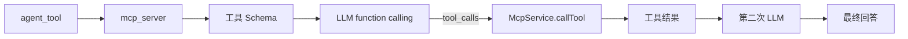

### 6.5 工作流原理

如果 Agent 绑定了工作流，对话会先执行工作流。

工作流引擎特点：

- 从 `START` 节点开始。
- 每个节点执行后把结果写入变量池。
- 连线决定下一个节点。
- `CONDITION` 节点根据输出变量匹配连线的 `condition_expr`。
- 到达 `END` 节点后，根据 `outputVariable` 取最终输出。
- 执行记录写入 `workflow_run` 和 `workflow_node_run`。
- 为避免死循环，单次执行最多 50 步。

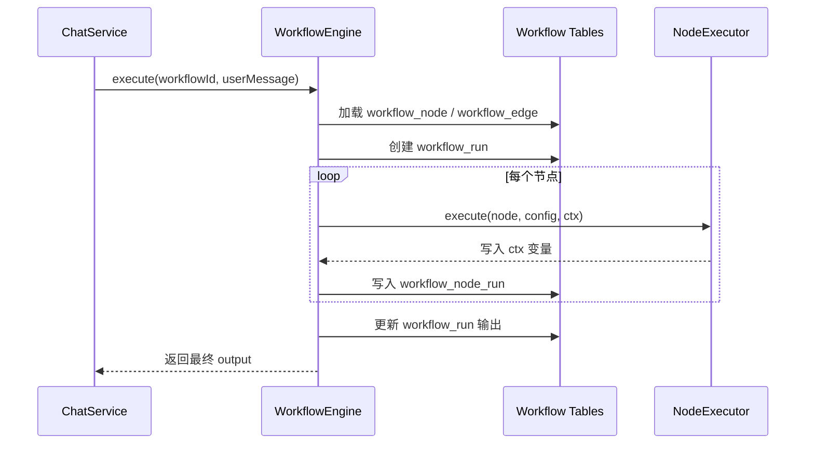

---

## 7. 各页面和后端功能对照清单

| 前端能力 | 当前页面状态 | 后端/数据支撑 | 产品说明口径 |
| --- | --- | --- | --- |
| Provider CRUD | 已有 | `ProviderController`, `provider` | 用户可新增、编辑、删除模型提供商 |
| Provider 连通测试 | 已有 | `ProviderConnectionTestService` | 用户可验证 API Key/Base URL 是否可用 |
| 模型配置 CRUD | 前端缺少完整管理入口 | `model_config` 表，Agent 校验依赖 | 模型管理中应有模型配置面板，供 Agent 选择 |
| Provider 健康状态 | 已展示 | `provider_health`, 定时任务 | 展示 UP/DOWN/DEGRADED/UNKNOWN |
| 知识库 CRUD | 已有 | `KnowledgeController`, `knowledge_base` | 用户可管理知识库 |
| 文档上传/状态/分块预览 | 已有 | `document`, `KnowledgeService` | 用户可上传文档并查看 chunks |
| Agent 基础配置 | 已有 | `AgentController`, `agent` | 用户可配置 Prompt、模型、温度、上下文 |
| Agent 绑定 MCP | 前端有页签但未加载 MCP 列表 | `agent_tool`, `/agents/{id}/tools` | 用户可勾选 MCP Server 绑定到 Agent |
| Agent 绑定知识库 | 当前前端缺少选择器 | `agent.knowledge_base_id`, Chat RAG 链路 | 用户可选择知识库启用 RAG |
| Agent 绑定工作流 | 当前前端缺少选择器 | `agent.workflow_id`, WorkflowEngine | 用户可选择工作流启用流程模式 |
| MCP CRUD / 测试 / 调试 | 已有 | `McpController`, `mcp_server` | 用户可接入和调试外部工具 |
| 工作流创建/列表/详情 | 已有基础 JSON 创建 | `workflow*` 表，`WorkflowService` | 用户可创建和查看工作流 |
| 工作流可视化编排 | 当前缺少 | 后端节点/边模型可支撑 | 产品完成态建议提供画布式节点编排 |
| 工作流发布/禁用 | 后端 status 字段支持，前端仅展示 | `workflow.status` | 用户可发布或禁用工作流 |
| 对话会话管理 | 已有 | `chat_session` | 用户可新建、选择、删除会话 |
| 流式对话 | 页面已有交互 | `/messages/stream`, `SseEmitter` | 用户发送后看到逐步输出 |
| 聊天能力标签 | 已部分展示工作流/知识库 | Agent list 返回相关 id | 对话新建会话时展示 Agent 能力 |

---

## 8. 当前前端缺失功能的产品补充说明

以下内容是使用手册按“前端已实现”进行说明的部分，也是后续前端补齐时应优先实现的功能。

### 8.1 模型配置面板

模型管理页应在 Provider 行内或详情抽屉中提供“模型配置”区域：

- 新增模型：填写 `name`, `modelId`, `contextSize`, `extraParams`。
- 编辑模型：修改展示名、模型 ID、上下文窗口。
- 启用/禁用模型。
- 可选：点击“从服务商同步模型”，调用 Provider Adapter 的 `listModels` 能力生成候选模型。

没有模型配置时，Agent 无法选择 `modelConfigId`，即使 Provider 已经创建也不能完成 Agent 创建。

### 8.2 Agent 绑定知识库

Agent 编辑弹窗应增加“知识库绑定”页签：

- 下拉选择启用的知识库。
- 支持“不绑定知识库”。
- 绑定后，Agent 列表展示“知识库”标签。
- 保存时调用 `PUT /api/v1/agents/{id}`，提交 `knowledgeBaseId`。

### 8.3 Agent 绑定工作流

Agent 编辑弹窗应增加“工作流绑定”页签：

- 下拉选择 `PUBLISHED` 或可运行工作流。
- 支持“不绑定工作流”。
- 绑定后，对话页面显示“工作流模式”标签。
- 保存时调用 `PUT /api/v1/agents/{id}`，提交 `workflowId`。

注意：工作流绑定后，对话优先走工作流。若希望同时使用知识库，应在工作流内部配置 `KNOWLEDGE` 节点。

### 8.4 Agent 工具绑定列表

Agent 的“工具绑定”页签当前有 UI 但未加载 MCP Server。完成态应：

- 调用 `GET /api/v1/mcp-servers?page=1&pageSize=100&enabled=1`。
- 展示 Server 名称、Endpoint、描述、工具数。
- 保存时调用 `PUT /api/v1/agents/{id}/tools`。

### 8.5 工作流可视化编排

当前工作流创建页使用 JSON 编辑器。完成态建议提供画布：

- 左侧节点库：START、LLM、KNOWLEDGE、CONDITION、API_CALL、END。
- 中间画布：拖拽节点、连线、删除节点。
- 右侧属性面板：编辑节点 config。
- 顶部操作：保存草稿、发布、测试运行。

底层仍然保存为 `nodes` 和 `edges` JSON，与现有后端接口兼容。

### 8.6 对话流式接口

产品完成态下，前端发送流式消息应调用：

```text
POST /api/v1/chat/sessions/{sessionId}/messages/stream
```

并处理 SSE 事件：

| 事件类型 | 含义 |
| --- | --- |
| `delta` | 增量文本 |
| `done` | 回复完成，包含 `finishReason` 和 `latencyMs` |
| `error` | 后端错误 |

---

## 9. 端到端示例：构建“售后客服 Agent”

### 9.1 配置模型

在“模型管理”新增：

| 字段 | 示例 |
| --- | --- |
| 名称 | `OpenAI` |
| 类型 | `OPENAI` |
| Base URL | `https://api.openai.com` |
| API Key | 填写真实 key |

在模型配置中新增：

| 字段 | 示例 |
| --- | --- |
| 模型名称 | `GPT-4o` |
| 模型 ID | `gpt-4o` |
| 上下文窗口 | `128000` |
| 状态 | 启用 |

### 9.2 建知识库

在“知识库”创建：

| 字段 | 示例 |
| --- | --- |
| 名称 | `售后政策知识库` |
| 描述 | `退款、退货、保修、物流常见问题` |

上传文档：

- `refund-policy.md`
- `warranty-faq.md`
- `shipping-faq.txt`

等待状态变为“已完成”，查看分块是否合理。

### 9.3 接入工具

在“MCP 工具”新增：

| 字段 | 示例 |
| --- | --- |
| 名称 | `退款服务` |
| Endpoint | `http://localhost:9001/mcp` |
| 描述 | `提供退款资格查询、提交退款、查询退款进度等工具` |

测试连接后，进入“调试”执行：

```json
{
  "orderId": "20240501001",
  "userId": "mock-user"
}
```

确认工具能返回正确结果。

### 9.4 创建工作流

在“工作流”创建“智能客服分类工作流”，节点逻辑：

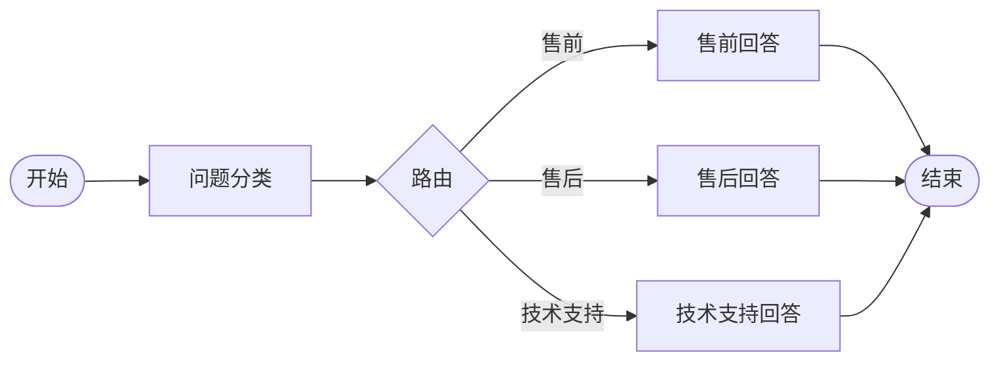

如果只是让 Agent 直接使用知识库和工具，可以不绑定工作流。

### 9.5 创建 Agent

在“Agent”新增：

| 字段 | 示例 |
| --- | --- |
| 名称 | `售后客服 Agent` |
| 模型 | `OpenAI / GPT-4o` |
| Temperature | `0.3` |
| 最大输出 Token | `2048` |
| 上下文轮数 | `10` |
| 绑定知识库 | `售后政策知识库` |
| 绑定 MCP 工具 | `退款服务` |
| 绑定工作流 | 可选：`智能客服分类工作流` |

System Prompt：

```text
你是 Hify 电商平台的售后客服。
回答必须基于可用知识库、工具结果或用户明确提供的信息。
涉及退款、订单、物流状态时，优先调用工具查询。
涉及规则、政策、保修说明时，优先使用知识库资料。
无法确认时请说明“当前无法确认”，不要编造。
输出使用中文，结构清晰，必要时用列表。
```

### 9.6 对话测试

在“对话”中选择“售后客服 Agent”，依次测试：

| 用户问题 | 预期链路 | 预期表现 |
| --- | --- | --- |
| `订单 20240501001 可以退款吗？` | MCP 工具 | 调用退款资格工具，回复是否可退 |
| `退款多久到账？` | RAG | 检索售后政策知识库，基于资料回答 |
| `我想咨询产品功能` | 直接 LLM 或工作流售前分支 | 按售前语气回答 |
| `刚才那个订单帮我申请退款` | 上下文 + MCP | 使用上下文中的订单号并调用退款工具 |

---

## 10. 常见问题

### 为什么 Agent 下拉里没有模型？

检查：

- Provider 是否启用。
- Provider 下是否有启用的 `model_config`。
- 模型配置是否被正确保存到数据库。

### 为什么知识库回答没有引用文档？

检查：

- Agent 是否绑定知识库。
- 文档状态是否为 `DONE`。
- 文档是否有分块。
- 当前 mock 模式检索只是模拟，生产环境应接入向量检索。

### 为什么工具没有被调用？

检查：

- Agent 是否绑定对应 MCP Server。
- MCP Server 是否启用。
- Server 连通测试是否成功。
- 工具 schema 是否能被拉取。
- 用户问题是否明确触发工具调用意图。

### 为什么绑定工作流后不走普通知识库/工具？

工作流优先级最高。Agent 绑定 `workflowId` 后，对话直接进入工作流。需要知识库或外部系统能力时，应在工作流中添加 `KNOWLEDGE` 或 `API_CALL` 节点，或在产品层面扩展工作流节点支持 MCP 调用。

### 为什么本地 mock 模式可以跑，生产 MySQL 报缺表或缺字段？

当前 H2 mock schema 比 MySQL schema 更完整。生产环境需要补齐：

- `knowledge_base`
- `document`
- `workflow`
- `workflow_node`
- `workflow_edge`
- `workflow_run`
- `workflow_node_run`
- `agent.knowledge_base_id`
- `agent.workflow_id`

---

## 11. 一句话心智模型

Hify 的核心不是“聊天框”，而是这条配置和运行链：

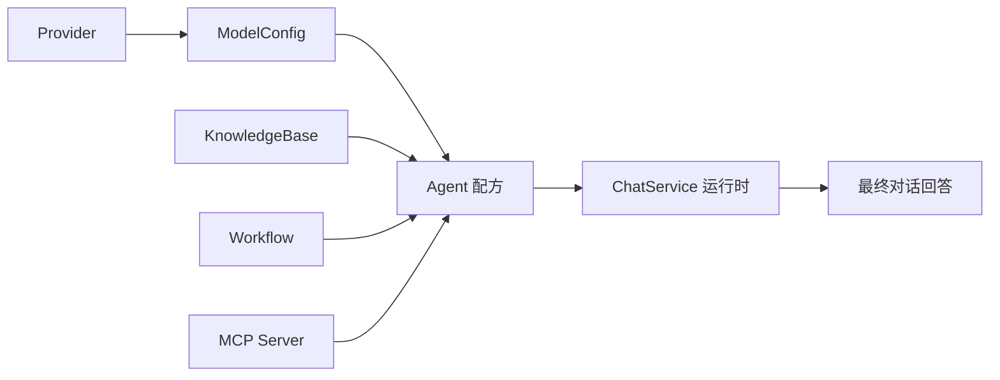

Provider 解决“调用哪个模型”，Knowledge 解决“依据什么资料”，MCP 解决“能操作哪些外部系统”，Workflow 解决“按什么流程执行”，Agent 把这些能力组装成一个具体业务助手，ChatService 则在每次对话中按 Agent 配方完成运行编排。
