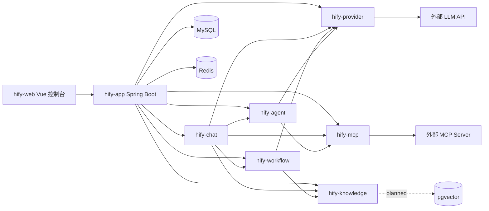
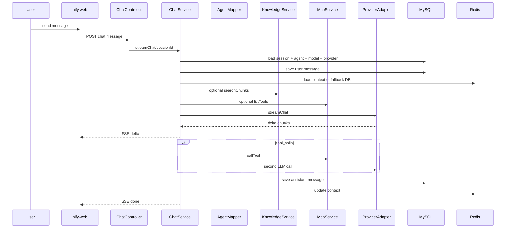

# Hify 源码研究报告

分析对象：`vendors/hify`，提交 `fe4f891`。  
分析方式：只基于本地源码、配置、部署脚本和项目规范阅读，不依赖外部介绍。

## 一句话结论

Hify 是一个面向团队内部的小型 AI Agent 开发与运行平台。它想解决的核心问题不是“训练模型”，也不是“做一个通用聊天壳”，而是把大模型应用落地时最常见的几块能力收拢到一个可部署的控制台里：

- 管模型提供商和模型配置。
- 配 Agent：模型、System Prompt、上下文轮数、知识库、工作流、MCP 工具。
- 跑对话：流式输出、多轮上下文、RAG、工具调用、工作流分流。
- 管知识库、MCP Server、工作流和运行观测。

它的本质定位可以概括为：

> 一个简化版 Dify / Coze 式的“Agent 配置控制台 + 轻量运行时”，后端是模块化单体，`hify-chat` 是运行时中枢，`hify-provider`、`hify-knowledge`、`hify-mcp`、`hify-workflow` 都是被 Chat 调度的能力插件。

## 项目定位

源码里的 `CLAUDE.md` 明确写出目标：Hify 是“简版的 AI Agent 开发平台（参考 Dify）”，可本地部署，面向团队内部 20-50 人规模使用。这个定位和代码形态高度一致：

- 它不是多租户 SaaS，没有用户、组织、权限、计费、审计这类 SaaS 外壳。
- 它不是纯聊天产品，因为聊天前面有 Agent、Provider、Knowledge、MCP、Workflow 的配置面。
- 它也不是成熟的生产级 RAG / Workflow / Tool Calling 平台，因为知识库、真实工具调用、模型工具协议、数据库迁移仍有明显半成品痕迹。
- 它更像一个“AI 应用搭建后台”：让内部团队把多个模型、提示词、知识库、外部工具和流程编排组装成可对话的 Agent。

如果用平面分层看，它分成两层：

```text
控制面：Provider 管理 / Agent 管理 / MCP 管理 / Knowledge 管理 / Workflow 管理 / 前端控制台

运行面：ChatService 根据 Agent 配置，在一次用户请求里决定走：
       直接 LLM
       LLM + RAG
       LLM + MCP 工具
       Workflow
```

## 最核心的心智模型

Hify 最内核的抽象不是“聊天消息”，而是这条链：

```text
Provider -> ModelConfig -> Agent -> ChatSession -> ChatMessage
                         -> KnowledgeBase
                         -> Workflow
                         -> MCP Server
```

也就是说：

- `Provider` 表示“能调用哪个模型厂商以及如何鉴权”。
- `ModelConfig` 表示“具体可用模型或 deployment”。
- `Agent` 是真正的业务入口，它把模型、提示词、上下文策略、知识库、工作流和工具绑在一起。
- `ChatSession` 只是某个 Agent 的一次会话容器。
- `ChatMessage` 是运行结果的流水账。

一次对话请求不是直接问模型，而是先找到会话绑定的 Agent，再根据 Agent 的配置决定怎么处理：

```text
用户消息
  -> ChatService
  -> 读取 ChatSession / Agent
  -> 如果 Agent.workflowId 存在：执行 WorkflowEngine
  -> 否则：
       读取 ModelConfig / Provider
       读取 Redis 或 MySQL 上下文
       如果 Agent.knowledgeBaseId 存在：检索知识库 chunk
       如果 Agent 绑定 MCP：构造 tool schemas
       调用 ProviderAdapter.streamChat / chat
       如果模型要求 tool_calls：调用 MCP，再进行第二轮模型调用
       保存 assistant 消息，更新上下文缓存
       通过 SSE 返回 delta/done
```

这就是项目最值得把握的主轴：**Agent 是配置配方，ChatService 是运行编排器，Provider/Knowledge/MCP/Workflow 是可被编排的能力模块。**

## 架构总览

源码是 Maven 多模块 + Vue 前端：

```text
vendors/hify/
  hify-app/        Spring Boot 启动模块，聚合所有业务模块
  hify-common/     公共基础设施：响应、异常、MyBatis、Redis、线程池、HTTP、指标、日志
  hify-provider/   模型提供商、模型配置、ProviderAdapter 适配器层
  hify-agent/      Agent 配置与 Agent-MCP 绑定
  hify-chat/       对话运行时，串联 Agent/Provider/RAG/MCP/Workflow
  hify-mcp/        MCP Server 管理、工具列表、工具调试、工具调用
  hify-knowledge/  知识库、文档上传、mock chunk、mock RAG 检索
  hify-workflow/   工作流定义与同步执行引擎
  hify-web/        Vue 3 + Element Plus 管理控制台
  deploy/          Docker / K8s / Prometheus / Nginx 配置
```

根 `pom.xml` 中模块顺序为：

```text
hify-common
hify-provider
hify-mcp
hify-agent
hify-workflow
hify-knowledge
hify-chat
hify-app
```

`hify-app` 是唯一 Spring Boot 启动入口，`HifyApplication` 使用 `scanBasePackages = "com.hify"` 和 `@MapperScan("com.hify.**.mapper")` 扫描全部模块。因此这些模块不是独立微服务，而是一个模块化单体。



## 模块组成与定位

### hify-app：启动壳和部署入口

职责：

- 启动 Spring Boot 应用。
- 聚合所有业务模块依赖。
- 提供 `/api/v1/health`，检查 MySQL、Redis、pgvector。
- 提供 mock profile，使用 H2 内存库、禁用 Redis 自动配置、关闭 provider 健康检查任务。
- 提供日志配置，开发环境普通日志，生产环境 JSON 日志。

关键文件：

- `hify-app/src/main/java/com/hify/app/HifyApplication.java`
- `hify-app/src/main/java/com/hify/app/controller/HealthController.java`
- `hify-app/src/main/resources/application.yml`
- `hify-app/src/main/resources/application-mock.yml`
- `hify-app/src/main/resources/db/schema.sql`
- `hify-app/src/main/resources/db/schema-h2.sql`

这个模块自身没有业务，它的作用是把“模块化单体”装配成一个进程。

### hify-common：基础设施层

职责：

- 统一响应：`Result<T>`、`PageResult<T>`。
- 统一异常：`BizException`、`ErrorCode`、`GlobalExceptionHandler`。
- MyBatis-Plus 配置：分页插件、自动填充 `createdAt/updatedAt/deleted`、逻辑删除。
- Redis 配置：`RedisTemplate`、`RedisCacheManager`、`RedisUtil`。
- 线程池：`llmExecutor` 和 `asyncExecutor`。
- HTTP 客户端：`LlmHttpClient` 封装同步 POST、流式 POST、GET。
- 可观测性：`RequestLogInterceptor`、MDC traceId/sessionId/agentId、`HifyMetrics`。
- Resilience4j 熔断/重试：`CircuitBreakerService`。

这个模块定义了项目的工程底座。它让业务模块只关心自己的实体、服务、控制器。

需要注意：`CircuitBreakerService` 已经实现，但当前没有被 `hify-provider` 或 `hify-chat` 实际调用。也就是说，配置和代码里有熔断能力，但真实 LLM 调用链还没有接入它。

### hify-provider：模型提供商适配层

职责：

- 管理 Provider：名称、类型、baseUrl、authConfig、enabled、description。
- 管理 ModelConfig：模型 ID、上下文窗口、扩展参数、enabled。
- 维护 ProviderHealth：健康状态、最后检查时间、失败次数、延迟、错误信息。
- 提供 ProviderAdapter 接口，把不同厂商统一成：
  - `testConnection`
  - `listModels`
  - `chat`
  - `streamChat`
- 适配 OpenAI、OpenAI Compatible、Azure OpenAI、Anthropic、Ollama。
- mock profile 下使用 `MockProviderAdapter` 返回模拟结果。

核心抽象：

```java
public interface ProviderAdapter {
    List<String> supportedTypes();
    ConnectionTestResult testConnection(Provider provider, OkHttpClient testClient);
    List<String> listModels(Provider provider, OkHttpClient client);
    ChatResponse chat(Provider provider, ChatRequest request);
    ChatResponse streamChat(Provider provider, ChatRequest request, Consumer<String> onChunk);
}
```

这个模块是项目对外部 LLM 世界的“防腐层”：上游 `ChatService` 不需要知道 OpenAI、Anthropic、Ollama 的 HTTP 协议差异，只依赖统一的 `ProviderAdapter`。

当前实现成熟度：

- 基础厂商适配路径已经成形。
- 连通性测试、模型列表、同步调用、流式调用都有代码。
- OpenAI Compatible 复用 OpenAI 逻辑，Azure 覆盖 URL 和 header，Ollama 部分复用 OpenAI 格式。
- 真实工具调用还不完整：`ChatRequest` 有 `tools` 字段，`ChatResponse` 有 `toolCalls` 字段，但 OpenAI/Anthropic 真实 adapter 构造请求体时没有把 `tools` 写入 JSON，也没有解析 `tool_calls`。因此当前 real provider 路径下 Function Calling 基本没有闭环，mock provider 可以模拟。
- 前端 Provider 表单写入 `authConfig: { api_key: ... }`，后端 adapter 读取的是 `apiKey`。这会导致真实 provider 鉴权失败。
- 前端暴露了 `GEMINI` 类型，但后端没有 Gemini adapter，`ProviderAdapterFactory` 会抛“不支持的供应商类型”。
- 没有 ModelConfig 的 CRUD API。前端 Agent 表单要从 Provider 列表里提取模型，但 Provider 创建接口只创建 provider，不创建 model_config；测试连接返回 modelCount，也没有入库模型。因此除 mock seed 外，模型配置链路缺一块。

### hify-agent：Agent 配方管理

职责：

- 管理 Agent 的配置：
  - name
  - description
  - systemPrompt
  - modelConfigId
  - temperature
  - maxTokens
  - maxContextTurns
  - enabled
  - knowledgeBaseId
  - workflowId
- 通过 `agent_tool` 维护 Agent 与 MCP Server 的多对多绑定。
- 创建/更新 Agent 时校验 modelConfigId 是否存在且启用。

Agent 是 Hify 的业务中心对象。Provider 只是模型资源，MCP 是工具资源，Knowledge 是资料资源，Workflow 是流程资源；真正把这些资源组合成“一个可被用户对话的机器人”的是 Agent。

当前实现成熟度：

- 后端实体和接口已经支持 `knowledgeBaseId`、`workflowId`。
- 前端 Agent 表单目前只配置基础信息和工具绑定；没有提供知识库和工作流绑定控件。
- 前端 Agent 工具绑定里的 `mcpServers` 是空数组占位，没有调用 MCP Server 列表接口，因此控制台上实际无法选择工具。

### hify-chat：运行时中枢

这是整个项目最核心的模块。

职责：

- 会话管理：创建、列表、删除 `chat_session`。
- 消息管理：分页查询、保存 user/assistant 消息。
- 对话执行：
  - SSE 流式对话。
  - 同步对话。
  - 上下文窗口管理。
  - Redis 上下文缓存，TTL 2 小时。
  - RAG 检索拼入 system prompt。
  - MCP 工具 schema 注入和 tool_calls 二轮调用。
  - Agent 绑定 workflow 时转入 WorkflowEngine。
  - 记录 LLM、Chat、MCP 指标。

`ChatServiceImpl` 是项目的实际运行编排器。其核心分支是：

```text
if agent.workflowId != null:
    workflowEngine.execute(...)
else:
    load model/provider
    load context
    optional RAG
    optional MCP tool schemas
    providerAdapter.streamChat(...)
    optional tool_calls second round
    persist assistant
    update Redis context
```

运行时路径：



当前实现成熟度和明显问题：

- 后端有专门的 SSE endpoint：`POST /api/v1/chat/sessions/{sessionId}/messages/stream`。
- 前端 `streamMessage` 实际请求的是 `/api/v1/chat/sessions/{sessionId}/messages`，也就是同步接口；后端同步接口即使收到 `stream: true` 也调用 `syncChat`。这会导致前端按 SSE 解析一个普通 JSON 响应，流式聊天前端链路不通。
- `ChatMessageMapper.selectRecentBySessionId` 使用 `ORDER BY created_at ASC LIMIT #{limit}`。方法名是 recent，但实际取的是最早的 N 条，不是最近的 N 条；会话长了以后，上下文窗口会保留开头历史而不是最近历史。
- Tool calling 的 orchestration 在 ChatService 中已经写好，但真实 provider adapter 没有完整支持工具 schema 和 tool_calls 解析，因此这部分主要依赖 mock。

### hify-mcp：外部工具桥

职责：

- 管理 MCP Server：name、endpoint、enabled、description。
- 测试 MCP Server 连接并列出工具。
- 获取工具详情：name、description、inputSchema、required。
- 调试工具调用。
- 为 ChatService 提供 `listTools` 和 `callTool`。

它使用官方 MCP Java SDK：

- `McpClient.sync(...)`
- `HttpClientSseClientTransport`
- `client.initialize()`
- `client.listTools()`
- `client.callTool(...)`

定位上，`hify-mcp` 是 Agent 调外部系统的桥。比如客服 Agent 可通过 MCP Server 查订单、退货、物流。

当前实现成熟度：

- CRUD 和调试链路清楚。
- MCP 调用使用同步客户端，工具调用 timeout 30 秒，工具列表 timeout 5 秒。
- ChatService 中构造工具 schema 时，只使用工具名并自己构造固定参数 `orderId/userId`，没有复用 `listToolsDetail` 返回的真实 inputSchema。这让工具 schema 目前更像 demo 级适配。
- ChatService 中工具调用失败会 fallback 到 mock 订单/退款结果，这适合演示，但生产语义需要改。

### hify-knowledge：知识库与 RAG 雏形

职责：

- 管理知识库。
- 上传文档，支持 `txt/md/pdf`，最大 10MB。
- 异步处理文档，生成 chunk。
- 查询文档 chunk。
- 为 ChatService 和 Workflow 提供 `searchChunks`。

它的关键定位是给 Agent 提供 RAG 上下文。但当前实现明确是 mock：

- chunk 存在静态内存 `ConcurrentHashMap`，不是数据库，也不是 pgvector。
- txt/md 直接读取文本，按段落切分；pdf 只是占位文本，不解析 PDF。
- 检索不是 embedding，也不是向量相似度，而是对该知识库下 DONE 文档的所有 chunk 按 query hash 随机打乱后取 topK。
- `pom.xml` 引入了 pgvector，`application.yml` 配了 pgvector 健康检查，但真正的向量写入和检索没有实现。

因此这个模块的准确定位是：**RAG 产品形态已经搭出来了，真实检索内核还没有。**

### hify-workflow：轻量图执行引擎

职责：

- 管理工作流定义：workflow、node、edge。
- 节点类型：
  - `START`
  - `LLM`
  - `CONDITION`
  - `API_CALL`
  - `KNOWLEDGE`
  - `END`
- 存储运行记录：workflow_run、workflow_node_run。
- 执行时用 `ExecutionContext` 作为变量池，变量 key 形如 `nodeKey.varName`。
- 用 `{{nodeKey.varName}}` 做模板替换。
- 从 START 节点开始，按边逐步同步执行到 END。
- CONDITION 节点通过字符串匹配 edge 的 condition 决定分支。

这是一个非常轻量的工作流解释器，不是可视化编排引擎，也不是异步 DAG 调度器。它更像“对话前后的一段可配置决策链”。

当前实现成熟度：

- 核心执行循环清楚，有 MAX_STEPS 防止死循环。
- 节点执行器是插件式注册：`NodeExecutorRegistry` 注入全部 `NodeExecutor`。
- 执行记录有落库设计。
- API_CALL 只支持无 body 的 GET/通用 method，复杂 API 调用还没覆盖。
- LLM 节点只做一次同步 chat，不支持工具、流式、细粒度参数。
- WorkflowCreate 前端是 JSON 编辑器，不是拖拽画布，符合“简版”定位。

### hify-web：管理控制台

技术栈：

- Vue 3
- TypeScript
- Vite
- Vue Router
- Element Plus
- Axios
- Marked

页面结构：

- `/provider` 模型提供商管理
- `/agent` Agent 管理
- `/chat` 对话
- `/knowledge` 知识库
- `/knowledge/:kbId/documents` 文档管理
- `/workflows` 工作流列表
- `/workflows/create` JSON 创建工作流
- `/mcp` MCP Server
- `/mcp/:id/debug` MCP 调试

前端定位是“运维/配置型后台”，不是最终用户聊天入口。它用侧边栏组织模块，复用了 `HifyTable` 和 `HifyFormDialog`。

当前前后端契约不一致较多：

- Chat 流式 endpoint 请求错。
- Provider authConfig key 写成 `api_key`，后端读 `apiKey`。
- Provider 页面提供 Gemini，但后端没 adapter。
- Agent 页面不加载 MCP Server 列表，工具绑定不可用。
- Agent 页面不支持 knowledge/workflow 绑定，但后端已经有字段。

## 技术栈组成

### 后端

- Java 17
- Spring Boot 3.2.3
- Spring Web MVC
- Spring Validation
- Spring Cache
- Spring Data Redis
- Spring Actuator
- MyBatis-Plus 3.5.9
- MySQL Connector/J 8.3.0
- H2：mock profile
- OkHttp 4.12.0：LLM 和 API_CALL HTTP 请求
- Resilience4j 2.2.0：熔断/重试能力，当前未接入主调用链
- Micrometer + Prometheus registry：指标
- OpenTelemetry API：traceId 预留
- Logstash Logback Encoder：生产 JSON 日志
- MCP Java SDK 1.1.1：MCP client
- pgvector JDBC：已引入，真实向量检索未落地
- Lombok

### 前端

- Vue 3.4
- TypeScript 5.3
- Vite 5.1
- Vue Router 4.3
- Element Plus 2.6
- Axios 1.6
- Marked 17
- Element Plus Icons

### 数据与基础设施

- MySQL：业务主库。
- Redis：缓存和对话上下文。
- pgvector/PostgreSQL：规划中的向量库，目前主要在健康检查和依赖层出现。
- Docker：后端 JDK/JRE 多阶段镜像，前端 Node/Nginx 多阶段镜像。
- Docker Compose：backend + frontend。
- Kubernetes：backend/frontend/prometheus 部署文件。
- Prometheus：抓 `/actuator/prometheus`。
- Nginx：静态文件托管、API 反代、SSE 关闭 buffering。

## 数据模型

当前 MySQL DDL 的核心表：

```text
provider
model_config
provider_health
mcp_server
agent
agent_tool
chat_session
chat_message
```

H2 mock DDL 额外包含：

```text
knowledge_base
document
workflow
workflow_node
workflow_edge
workflow_run
workflow_node_run
```

这里有一个重要同步问题：

- `schema.sql` 是生产 MySQL DDL，只到 provider/mcp/agent/chat。
- `schema-h2.sql` 已经包含 knowledge/workflow 表，以及 agent 的 `knowledge_base_id`、`workflow_id`。
- Java 实体和业务代码已经依赖 knowledge/workflow 表。

因此生产 MySQL 初始化脚本落后于代码。若按当前 `schema.sql` 初始化 MySQL，再启动完整功能，knowledge/workflow/agent 关联字段会缺表或缺列。

## 关键调用链

### 1. 模型调用链

```text
ChatServiceImpl
  -> ModelConfigMapper / ProviderMapper
  -> ProviderAdapterFactory.get(provider.type)
  -> OpenAiAdapter / AnthropicAdapter / OllamaAdapter / AzureOpenAiAdapter
  -> LlmHttpClient
  -> 外部 LLM API
```

这个链路把“业务对话”和“厂商协议”隔离开。ProviderAdapter 是扩展新模型供应商的唯一主要入口。

### 2. RAG 调用链

```text
Agent.knowledgeBaseId
  -> ChatServiceImpl.searchChunks
  -> KnowledgeServiceImpl.searchChunks
  -> MOCK_CHUNKS
  -> 拼入 system prompt 的【参考资料】
  -> ProviderAdapter.chat/streamChat
```

目前 RAG 的产品链路已经打通，但检索质量由 mock 决定，不具备真实语义检索能力。

### 3. MCP 工具调用链

```text
Agent -> agent_tool -> mcp_server
  -> ChatServiceImpl.buildToolSchemas
  -> ProviderAdapter.streamChat 第一次调用
  -> ChatResponse.finishReason == tool_calls
  -> McpService.callTool
  -> ProviderAdapter.streamChat 第二次调用
```

设计思路是标准 Function Calling 二轮调用。但真实 adapter 还没把工具 schema 发给模型，也没解析真实 tool_calls，因此现阶段主要是 mock 演示链路。

### 4. Workflow 调用链

```text
Agent.workflowId
  -> ChatServiceImpl
  -> WorkflowEngine.execute(workflowId, userMessage)
  -> START
  -> NodeExecutorRegistry
  -> LLM / CONDITION / API_CALL / KNOWLEDGE
  -> END
  -> SSE 逐字符返回结果
```

Workflow 在对话链路中的优先级高于直接 LLM：只要 Agent 绑定了 workflow，就不走普通 RAG/MCP 直接对话路径。

## 当前完成度判断

### 已经成形的部分

- Maven 多模块和后端分层清晰。
- 模块化单体结构适合小团队内部部署。
- ProviderAdapter 抽象合理，便于扩展厂商。
- ChatService 的运行编排主线完整。
- Agent/Provider/MCP/Knowledge/Workflow 的产品边界清楚。
- SSE、Redis 上下文、MySQL 消息持久化、指标、日志、健康检查都有工程意识。
- Docker/K8s/Prometheus/Nginx 部署素材已经具备。

### 半成品或需要修正的部分

- 生产 MySQL DDL 落后，缺 knowledge/workflow 表和 agent 新字段。
- ModelConfig 没有 CRUD/API/UI，导致 Provider 到 Agent 的模型配置链路不完整。
- 前端流式聊天请求错 endpoint。
- 前端 Provider authConfig key 与后端 adapter 不一致。
- Gemini 前端可选但后端不支持。
- 真实 provider 的工具调用未完成：不传 `tools`，不解析 `tool_calls`。
- Knowledge 模块是 mock，chunk 不持久化，向量检索未实现。
- Agent 前端不能绑定知识库/工作流，工具绑定也未加载 MCP Server。
- CircuitBreakerService 未接入真实模型调用链。
- Docker Compose 前端 build context 是 `./hify-web`，但 `hify-web/Dockerfile` 试图 `COPY deploy/docker/nginx.conf`，该路径不在前端 build context 内，前端镜像构建会失败。
- 没有测试目录，当前无法从测试覆盖判断行为稳定性。

## 这套系统的“内核图”

如果只保留 Hify 最本质的东西，可以抽象成下面这张图：

```text
                     +----------------+
                     |    Provider    |
                     | auth/base_url  |
                     +-------+--------+
                             |
                       +-----v------+
                       | ModelConfig |
                       +-----+------+
                             |
       +-----------+   +-----v------+   +-------------+
       | Knowledge |<--+   Agent    +-->|  MCP Server |
       +-----------+   | Prompt      |   +-------------+
                       | model       |
                       | workflow    |
                       | tools       |
                       +-----+------+
                             |
                       +-----v------+
                       | ChatService |
                       | runtime     |
                       +-----+------+
                             |
        +--------------------+--------------------+
        |                    |                    |
  Direct LLM/RAG       Tool Calling         WorkflowEngine
        |                    |                    |
        +--------------------+--------------------+
                             |
                       ChatMessage
```

关键理解：

- Provider 是“算力供应”。
- Knowledge 是“上下文供应”。
- MCP 是“外部动作供应”。
- Workflow 是“流程控制供应”。
- Agent 是把这些供应拼成一个业务角色的配置体。
- ChatService 是把配置体真正运行起来的解释器。

## 建议下一步优先级

如果目标是让 Hify 从“演示可跑”变成“内部真实可用”，优先级应当是：

1. 修正前后端契约：SSE endpoint、authConfig key、Gemini 选项、Agent 工具/知识库/工作流绑定。
2. 补齐 ModelConfig 管理：Provider 测试后拉取模型、选择模型入库、模型启停。
3. 同步生产 DDL：补 knowledge/workflow 表、agent 新字段，最好引入 Flyway/Liquibase。
4. 完成真实 Function Calling：adapter 写入 tools、解析 tool_calls、支持 tool role 消息。
5. 将 Knowledge 从 mock 替换为真实 pipeline：文档解析、chunk 表、embedding、pgvector 检索。
6. 把 CircuitBreakerService 接入 LLM 调用链。
7. 加最小测试：ProviderAdapter 请求体、ChatService 直接路径、WorkflowEngine 分支、Knowledge mock 检索、前端 API 契约。

## 源码证据索引

- 模块定义与技术版本：`pom.xml`
- 项目定位和规范：`CLAUDE.md`
- Spring Boot 启动入口：`hify-app/src/main/java/com/hify/app/HifyApplication.java`
- 健康检查：`hify-app/src/main/java/com/hify/app/controller/HealthController.java`
- 生产配置：`hify-app/src/main/resources/application.yml`
- mock 配置：`hify-app/src/main/resources/application-mock.yml`
- MySQL DDL：`hify-app/src/main/resources/db/schema.sql`
- H2 DDL：`hify-app/src/main/resources/db/schema-h2.sql`
- Provider adapter 抽象：`hify-provider/src/main/java/com/hify/provider/adapter/ProviderAdapter.java`
- OpenAI adapter：`hify-provider/src/main/java/com/hify/provider/adapter/impl/OpenAiAdapter.java`
- Agent 实体：`hify-agent/src/main/java/com/hify/agent/entity/Agent.java`
- Chat 核心编排：`hify-chat/src/main/java/com/hify/chat/service/impl/ChatServiceImpl.java`
- MCP 调用：`hify-mcp/src/main/java/com/hify/mcp/service/impl/McpServiceImpl.java`
- Knowledge mock RAG：`hify-knowledge/src/main/java/com/hify/knowledge/service/impl/KnowledgeServiceImpl.java`
- Workflow 引擎：`hify-workflow/src/main/java/com/hify/workflow/engine/WorkflowEngine.java`
- 前端路由：`hify-web/src/router/index.ts`
- 前端 Chat API：`hify-web/src/api/chat.ts`
- 前端 Provider 页面：`hify-web/src/views/provider/ProviderList.vue`
- Docker Compose：`docker-compose.yml`
- Nginx 配置：`deploy/docker/nginx.conf`
